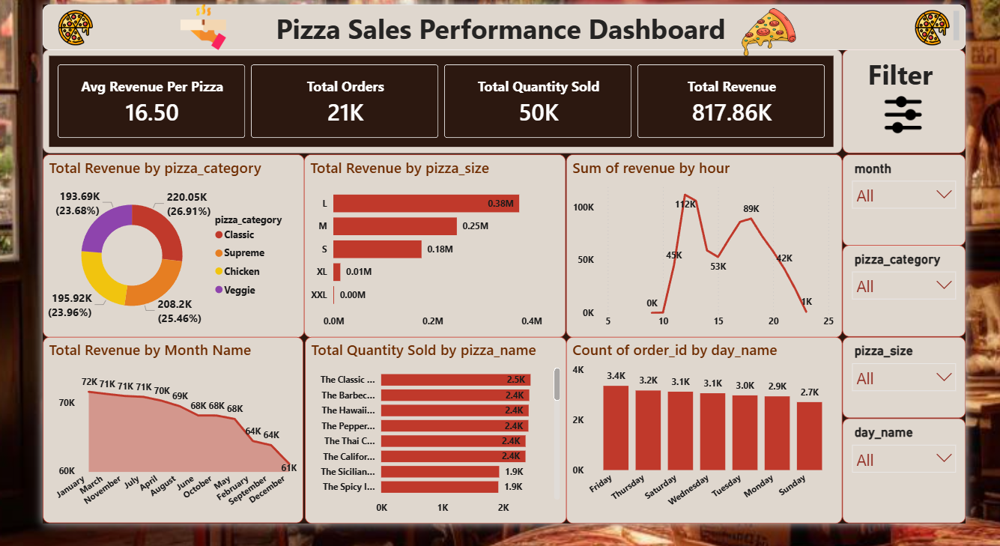

# 🍕 Pizza Sales Performance Dashboard

## 📌 Overview
This Power BI dashboard analyzes pizza shop sales performance using interactive visualizations and business insights.

---

## 📊 Key Metrics
- Total Revenue: 817.86K
- Total Orders: 21K
- Total Quantity Sold: 50K
- Avg Revenue Per Pizza: 16.50

---

## 📈 Dashboard Insights
- Revenue analysis by pizza category
- Revenue distribution by pizza size
- Monthly revenue trends
- Hourly sales performance
- Best-selling pizza types
- Order count by weekdays

---

## 🛠 Tools Used
- Power BI
- DAX
- Power Query
- Excel / CSV Dataset

---

## 🎯 Features
- Interactive filters
- KPI cards
- Modern dashboard design
- Business performance tracking
- Dynamic visualizations

---

## 📂 Files Included
- Pizza Sales Dashboard (.pbix)
- Dataset files
- Dashboard Screenshot

---

## 🚀 Business Benefits
This dashboard helps identify:
- Top-selling pizzas
- Peak sales hours
- Customer ordering trends
- Revenue growth opportunities

---

## 📷 Dashboard Preview

---

## 👨‍💻 Author
Muhammed Sinan
